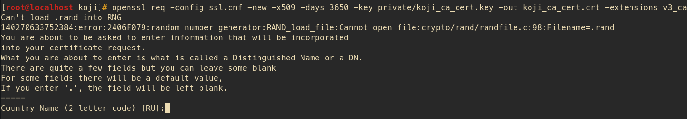

# WORK IN PROGRESS


## Установка Koji на виртуальную машину

[источник раз](https://docs.pagure.org/koji/server_howto/) |
[источник два](devops-blog.net/koji/koji-rpm-build-system-installation-part-1)

#### Из чего состоит Koji


Во-первых, есть Koji-Hub, который является сязующим звеном между всеми остальными элементами. В большинстве случаев, вместо того чтобы работать напрямую друг с другом они взаимодействуют через koji-hub

Далее, Kojira, сервис, занимающийся созданием и присмотром за yum/dnf репозиториями

KojiD - должен быть как минимум один. Это демон, которые делает основную работу (собирает rpm). Его можно выделить в отдельный инстанс, их может быть много, если вы планируете работать с большим количеством одновременных сборок

Koji-Web - это веб-интерфейс Koji. Полного контроля над процессом с его помощью не получишь, но с ним красивее. В общем то можно обойтись и без него, но мы не будем

Koji-Client - командный интерфейс Koji. Вот тут у нас полный контроль над всеми возможностями

Все эти части могут работать на физически разных серверах, аутентификация соединения происходил либо через Kerberos,  либо через SSL.

Но мы все это добро поставим на одну слабую виртуалку, потому что можем :)

[comment]: <> (нарисовать свое)


#### Что потребуется:

Знания:
- Базовое понимание SSL и аутентификации с помощью сертификатов (неплохо почитать про Kerberos, потому как это второй вариант аутентификации в koji)
- Базовые знания по созданию БД в Postgres и импортирование в нее схемы
- Немного уметь работать с psql
- Чуть знаний Apache
- Базовые навыки работы с dnf/yum/createrepo/mock
- Было бы неплохо владение командной строкой
- Основы по сборке RPM пакетов (иначе зачем вам все это)
- Зачатки умения работы с клиентом koji

#### Из пакетов понадобятся:

На серверной стороне(koji-hub/koji-web)
- httpd (Apache http-сервер)
- mod_ssl (SSL модуль для HTTP сервера Apache)
- postgresql-server (Серверная часть СУБД)
- mod_wsgi (Модуль для HTTP сервера который предоставляет питоновский интерфейс)

На сборочной стороне(koji-builder)
- mock
- setarch
- rpm-builder
- createrepo

[comment]: <> (написать про каждую либу)

___

#### Подготовительный этап

1) Ставим RED OS (7.3.1 на момент написания) в варианте минимальный сервер. В принципе можно поставить сервера postgres и apache, но лучше сделать это самим  

2) Для удобства работы настроим вторую сетевую карту на виртуалке и пробросим порты для подключения по SSH (я использую virtualbox, полагаю на других виртуалках схожие возможности имеются)  

[comment]: <> (написать про возможность бриджа и подключения к виртуалке извне)

 

3) Подключаемся как root (если включили такую возможность. В противном случае как юзер)  


```
ssh -p 3022 root@127.0.0.1
```

Может получиться так, что у вас уже есть ключи для локалки. В этом случае получите такое сообщение:  


Удаляем все упоминания 127.0.0.1 в файле ~/.ssh/known_hosts и пробуем еще раз


4) Делаем снапшот еще пустой системы, дабы если что-то пойдет сильно не так можно было быстро откатиться

Все, теперь работаем как белые люди, не нужно настраивать clipboard'ы и т.п.

___


#### *Аутентификация в Koji работает либо через Kerberos, либо через SSL. В данном гайде рассматривается SSL*

С этого и начнем

___

## Создание сертификатов

*С высокой долей вероятности, если Вы раньше не работали с генерацией сертификатов, то после этого гайда Вы будете их ненавидеть*

*CA это Certificate Authority.*

Это пара ключ/сертификат используемая для подписи всех прочих запросов сертификации. Когда мы будем конфигурировать разные куски Koji оба сертификата - и клиентский, и серверный будут копией CA сгенерированного здесь. CA сертификат будет размещен в /etc/pki/koji, а сертификаты для остальных компонентов в /etc/pki/koji/certs.  

index.txt - это база сгенерированных сертификатов. В нем удобно быстро посмотреть когда, кому и что выдали

Для начала, создадим директорию /etc/pki/koji  

```
mkdir -p /etc/pki/koji
```

и поместим туда следующий конфигурационный файл для генерации сертов  

*ssl.cnf*
``` 
HOME                            = .
RANDFILE                        = .rand

[ca]
default_ca                      = ca_default

[ca_default]
dir                             = .
certs                           = $dir/certs
crl_dir                         = $dir/crl
database                        = $dir/index.txt
new_certs_dir                   = $dir/newcerts
certificate                     = $dir/%s_ca_cert.pem
private_key                     = $dir/private/%s_ca_key.pem
serial                          = $dir/serial
crl                             = $dir/crl.pem
x509_extensions                 = usr_cert
name_opt                        = ca_default
cert_opt                        = ca_default
default_days                    = 3650
default_crl_days                = 30
default_md                      = sha256
preserve                        = no
policy                          = policy_match

[policy_match]
countryName                     = match
stateOrProvinceName             = match
organizationName                = match
organizationalUnitName          = optional
commonName                      = supplied
emailAddress                    = optional

[req]
default_bits                    = 2048
default_keyfile                 = privkey.pem
default_md                      = sha256
distinguished_name              = req_distinguished_name
attributes                      = req_attributes
x509_extensions                 = v3_ca # The extensions to add to the self signed cert
string_mask                     = MASK:0x2002

[req_distinguished_name]
countryName                     = Country Name (2 letter code)
countryName_default             = RU
countryName_min                 = 2
countryName_max                 = 2
stateOrProvinceName             = State or Province Name (full name)
stateOrProvinceName_default     = Vladimir
localityName                    = Locality Name (eg, city)
localityName_default            = Murom
0.organizationName              = Organization Name (eg, company)
0.organizationName_default      = RED-SOFT
organizationalUnitName          = Organizational Unit Name (eg, OS-DEVEL)
commonName                      = insert_hostname
commonName_max                  = 64
emailAddress                    = Email Address
emailAddress_max                = 64

[req_attributes]
challengePassword               = strong and complicated password
challengePassword_min           = 4
challengePassword_max           = 20
unstructuredName                = An optional company name

[usr_cert]
basicConstraints                = CA:FALSE
nsComment                       = "OpenSSL Generated Certificate"
subjectKeyIdentifier            = hash
authorityKeyIdentifier          = keyid,issuer:always

[v3_ca]
subjectKeyIdentifier            = hash
authorityKeyIdentifier          = keyid:always,issuer:always
basicConstraints                = CA:true
```

Если бы мы ставили Koji на систему на базе Centos 6, дефолтное шифрование было бы:
```
default_md = md5
```

Секцию *[req_distinguished_name]* можно отредактировать под свои нужды, дабы потом не приходилось менять дефолтные значения (город например) при каждой генерации сертификата. А их будет много

Поехали дальше

```
cd /etc/pki/koji/
mkdir {certs,private,confs}
touch index.txt
echo 01 > serial
openssl genrsa -out private/koji_ca_cert.key 2048
openssl req -config ssl.cnf -new -x509 -days 3650 -key private/koji_ca_cert.key \
-out koji_ca_cert.crt -extensions v3_ca
```

Скорее всего при выполнении последней команды у вас возникнет ошибка следующего характера:



Это происходит потому, что openssl ожидает увидеть объявленный в ssl.cnf файл .rand в текущей директории. А его там скорее всего нет. Надо это исправлять

```
openssl rand -writerand .rand
```

После этого повторяем команду

```
openssl req -config ssl.cnf -new -x509 -days 3650 -key private/koji_ca_cert.key \
-out koji_ca_cert.crt -extensions v3_ca
```

На отсутствующий файл ругаться перестанет и мы заполним дефолтные значения сертификата, например:

```
You are about to be asked to enter information that will be incorporated
into your certificate request.
What you are about to enter is what is called a Distinguished Name or a DN.
There are quite a few fields but you can leave some blank
For some fields there will be a default value,
If you enter '.', the field will be left blank.
-----
Country Name (2 letter code) [RU]:
State or Province Name (full name) [Vladimir]:
Locality Name (eg, city) [Murom]:
Organization Name (eg, company) [RED-SOFT]:
Organizational Unit Name (eg, OS-DEVEL) []:os-dev
Common Name (your server's hostname) []:stapel667.red-soft.ru
Email Address []:
```

Там, гда после двоеточия ничего не поставлено - будут использоваться дефолтные значения, указанные в квадратных скобках. Именно их мы редактировали в файле ssl.cnf

Результат выполнения команды *tree* (если не поставили - рекомендую, облегчает понимание, что где лежит)

```
[root@localhost koji]# tree -a
.
├── certs
├── confs
├── index.txt
├── koji_ca_cert.crt
├── private
│   └── koji_ca_cert.key
├── .rand
├── serial
└── ssl.cnf
```

#### Еще про сертификаты

У каждого компонента Koji должен быть сертификат, идентифицирующий его. Два из них (для kojihub и koji-web) используются как сертификаты с серверной стороны, для аутентификации сервера-клиенту. Поэтому желательно, чтобы __Common Name__ (он же CN) у обоих этих сертификатов был во-первых одинаковым, а во-вторых, чтобы он был FQDN веб-сервера (fully qualified domain name. В случае этого примера: stapel667.red-soft.ru).  
__Organizational Unit Name__ (он же OU) можно сделать kojihub и kojiweb, чтобы их можно было отличить между собой.

Для других сертификатов (kojira, kojid, первичный админский аккаунт, все серты юзеров), используется наоборот, сертификат аутентифицирующий клиента-серверу.  
__Common Name__ для них должен быть логином конкретного компонента. 
Например CN для kojira будет, как ни удивительно, kojira. Причина для этого в том, что CN сертификата будет использоваться для сравнения с именем пользователя в базе данных koji. И если в базе данных не будет имени пользователя совпадающего с конкретным CN - аутентификация не пройдет.

Кстати, когда мы создадим сертификат для kojiweb, было бы неплохо точно запомнить все данные, которые мы вводили при генерации, так как это потребуется при конфигурировании файла /etc/koji-hub/hub.conf, а именно поля ProxyDNs

Для упрощения себе жизни создадим скрипт-генератор сертификатов  
Обзовем его certgen.sh

```
#!/bin/bash
# if you change your certificate authority name to something else you will
# need to change the caname value to reflect the change.
caname=koji

# user is equal to parameter one or the first argument when you actually
# run the script
user=$1

openssl genrsa -out private/${user}.key 2048

# when you creating an user certificate, it is nice, when script change 
# default CN to this username. 
# Anyway you have to type it, coz in other case it will be empty string
# insert_hostname keyword (or whatever) should be in your ssl.cnf file
cat ssl.cnf | sed 's/insert_hostname/'${user}'/'> ssl2.cnf

openssl req -config ssl2.cnf -new -nodes -out certs/${user}.csr -key private/${user}.key
openssl ca -config ssl2.cnf -keyfile private/${caname}_ca_cert.key -cert ${caname}_ca_cert.crt \
    -out certs/${user}.crt -outdir certs -infiles certs/${user}.csr
cat certs/${user}.crt private/${user}.key > ${user}.pem
mv ssl2.cnf confs/${user}-ssl.cnf
```

Далее, дадим ему права на запуск
```
chmod +x certgen.sh
```

Кроме того, создадим скрипт поменьше, для генерации сертификата для браузера. Это нам потребуется один раз (если повезет), но лишним не будет.  
Назовем его webcertgen.sh. Так же сделаем его запускаемым

```
#!/bin/bash
#if you change your certificate authority name to something else you will need to change the caname value to reflect the change.
caname=koji

# user is equal to parameter one or the first argument when you actually run the script
user=$1

openssl pkcs12 -export -inkey private/${user}.key -in certs/${user}.crt \
    -CAfile ${caname}_ca_cert.crt -out certs/${user}_browser_cert.p12
```

Посмотрим, что у нас имеется в директории /etc/pki/koji сейчас

```
[root@localhost koji]# tree -a --dirsfirst
.
├── certs
├── confs
├── private
│   └── koji_ca_cert.key
├── certgen.sh
├── index.txt
├── koji_ca_cert.crt
├── .rand
├── serial
├── ssl.cnf
└── webcertgen.sh
```

Когда мы сгенерируем сертификат для пользователя, ему потребуются, ${user}.pem, 
${caname}_ca_cert.crt и ${user}_browser_cert.p12.

Первым делом создадим админа koji и сертификаты для него.
В рамках этого гайда назовем его kojiadmin. Понятное дело, что в реальной системе он может быть назван как угодно

```
./certgen.sh kojiadmin
```
Как мы уже обсуждали, CN для всего, кроме koji-hub и koji-web, должен быть равен имени пользователя, иначе аутентификация не пройдет.  
Например:

```
Country Name (2 letter code) [RU]:
State or Province Name (full name) [Vladimir]:
Locality Name (eg, city) [Murom]:
Organization Name (eg, company) [RED-SOFT]:
Organizational Unit Name (eg, OS-DEVEL) []:os-dev
kojiadmin []:kojiadmin
Email Address []:
```
Видим, что в нужном месте наш скрипт вежливо подсказал, каким должен быть CN

Пошли дальше. Создадим пользователя в системе и скопируем ему сгенерированные сертификаты в домашнюю папку


```
useradd kojiadmin
su kojiadmin
mkdir ~/.koji
# ВАЖНО использовать PEM а не CRT
cp /etc/pki/koji/kojiadmin.pem ~/.koji/client.crt
cp /etc/pki/koji/koji_ca_cert.crt ~/.koji/clientca.crt
cp /etc/pki/koji/koji_ca_cert.crt ~/.koji/serverca.crt
exit
```

Настройки koji хранятся в файле /etc/koji.conf. Если требуется настройка в зависимости от пользователя, то можно разместить файл koji.conf в ~/.koji каждого конкретного юзера


### База данных

Мы будем использовать postgres, в теории можно любую.

Установим сервер БД и CLI koji

```
dnf install -y postgresql-server koji
```

Инициализируем БД и запускаем сервис

```
postgresql-setup --initdb --unit postgresql
systemctl enable postgresql --now
```

Создаем пользователя koji. Для удобства сделаем без пароля.

```
useradd koji
passwd -d koji
```

Теперь настроим postgres и создадим схему

```
su postgres
createuser --no-superuser --no-createrole --no-createdb koji
createdb -O koji koji
su koji
psql koji koji < /usr/share/doc/koji*/docs/schema.sql
```

__Важно__: Когда импортируем схему в чистую БД, важно чтобы это осуществлялось от лица koji юзера. Иначе будут проблемы

Отредактируем /var/lib/pgsql/data/pg_hba.conf 
Так как мы все делаем на одной машине: 
```
#TYPE   DATABASE    USER    CIDR-ADDRESS      METHOD
local   koji        koji                       trust
local   all         postgres                   peer
```

Пояснения:

* The local connection type means the postgres connection uses a local Unix socket, so PostgreSQL is not exposed over TCP/IP at all.

* The local koji user should only have access to the koji database. The local postgres user will have access to everything (in order to create the koji database and user.)

* The CIDR-ADDRESS column is blank, because this example only uses local Unix sockets.

* The trust method means that PosgreSQL will permit any connections from any local user for this username. We set this for the koji user because Apache httpd runs as the apache system user rather than the koji user when it connects to the Unix socket. trust is not secure on a multi-user system, but it is fine for a single-purpose Koji system.

* The peer method means that PostgreSQL will obtain the client’s operating system username and use that as the allowed username. This is safer than trust because only the local postgres system user will be able to access PostgreSQL with this level of access.

[comment]: <> (перевести)

В файле /var/lib/pgsql/data/postgresql.conf блокируем доступ по TCP/IP (мы ж на одной машине все делаем)

```
listen_addresses = ''
```

Перезапускаем postgres

```
systemctl reload postgresql
```

Создадим нашего __kojiadmin__'a в БД

```
su koji
psql
insert into users (name, status, usertype) values ('kojiadmin', 0, 0);
insert into user_perms (user_id, perm_id, creator_id) values (1, 1, 1);
```

С базой данный все.
Теперь опять к сертификатам

### Koji-hub

Установим apache, koji-hub и ssl-модуль для апача

```
dnf install -y httpd koji-hub mod_ssl
```

Сгенерируем сертификаты для kojihub и kojiweb. Как мы помним, CN в этом случае равен FQDN (в моем случае, stapel667.red-soft.ru), а OU - kojihub или kojiweb соответственно. Тут наша подсказка, которая заменяет CN, будет немного мешать, поэтому будьте внимательны и осторожны

```
cd /etc/pki/koji
./certgen.sh kojiweb
./certgen.sh kojihub
```

Что в нашей любимой папке:
```
[root@localhost koji]# tree -a --dirsfirst
.
├── certs
│   ├── 01.pem
│   ├── 02.pem
│   ├── 03.pem
│   ├── 04.pem
│   ├── kojiadmin.crt
│   ├── kojiadmin.csr
│   ├── kojihub.crt
│   ├── kojihub.csr
│   ├── kojiweb.crt
│   └── kojiweb.csr
├── confs
│   ├── kojiadmin-ssl.cnf
│   ├── kojihub-ssl.cnf
│   └── kojiweb-ssl.cnf
├── private
│   ├── kojiadmin.key
│   ├── koji_ca_cert.key
│   ├── kojihub.key
│   └── kojiweb.key
├── certgen.sh
├── index.txt
├── index.txt.attr
├── index.txt.attr.old
├── index.txt.old
├── kojiadmin.pem
├── koji_ca_cert.crt
├── kojihub.pem
├── kojiweb.pem
├── .rand
├── serial
├── serial.old
├── ssl.cnf
└── webcertgen.sh
```

В /etc/httpd/conf.d/kojihub.conf раскомментируем следующее:

```
# uncomment this to enable authentication via SSL client certificates
# <Location /kojihub/ssllogin>
#         SSLVerifyClient require
#         SSLVerifyDepth  10
#         SSLOptions +StdEnvVars
# </Location>
```

В /etc/httpd/conf.d/ssl.conf

```
SSLCertificateFile /etc/pki/koji/certs/kojihub.crt
SSLCertificateKeyFile /etc/pki/koji/private/kojihub.key
SSLCertificateChainFile /etc/pki/koji/koji_ca_cert.crt
SSLCACertificateFile /etc/pki/koji/koji_ca_cert.crt
```

В /etc/koji-hub/hub.conf

```
DBName = koji
DBUser = koji

KojiDir = /mnt/koji
LoginCreatesUser = On
KojiWebURL = http://stapel667.red-soft.ru/koji

DNUsernameComponent = CN
ProxyDNs = CN=stapel667.red-soft.ru,OU=kojiweb,O=RED-SOFT,ST=Vladimir,C=RU

```

Чтобы позволить апачу подсоединиться к БД

```
setsebool -P httpd_can_network_connect_db=1
```

### Подготовка файловой системы

```
cd /mnt
mkdir koji
cd koji
mkdir {packages,repos,work,scratch,repos-dist}
chown apache.apache *
```

Нужно поставить нехватающую либу (semanage)
```
dnf install -y policycoreutils-python-utils
```

Разрешим апачу писать в созданную файловую систему
```
setsebool -P allow_httpd_anon_write=1
semanage fcontext -a -t public_content_rw_t "/mnt/koji(/.*)?"
restorecon -r -v /mnt/koji
```

Запустим Apache

```
systemctl enable httpd.service --now
```

### Koji CLI

Зайдем в /etc/koji.conf

```
[koji]

;url of XMLRPC server
server = http://stapel667.red-soft.ru/kojihub

;url of web interface
weburl = http://stapel667.red-soft.ru/koji

;url of package download site
topurl = http://stapel667.red-soft.ru/kojifiles

;path to the koji top directory
topdir = /mnt/koji

; configuration for SSL athentication

;client certificate
cert = ~/.koji/client.crt

;certificate of the CA that issued the HTTP server certificate
serverca = ~/.koji/serverca.crt
```

Проверим

```
su kojiadmin
koji moshimoshi
```

Может возникнуть следующая проблема:

```
[kojiadmin@localhost koji]$ koji moshimoshi
2022-08-08 02:45:15,175 [ERROR] koji: SSLError: HTTPSConnectionPool(host='stapel667.red-soft.ru', port=443): Max retries exceeded with url: /kojihub/ssllogin (Caused by SSLError(SSLCertVerificationError(1, '[SSL: CERTIFICATE_VERIFY_FAILED] certificate verify failed: self signed certificate in certificate chain (_ssl.c:1108)')))
```