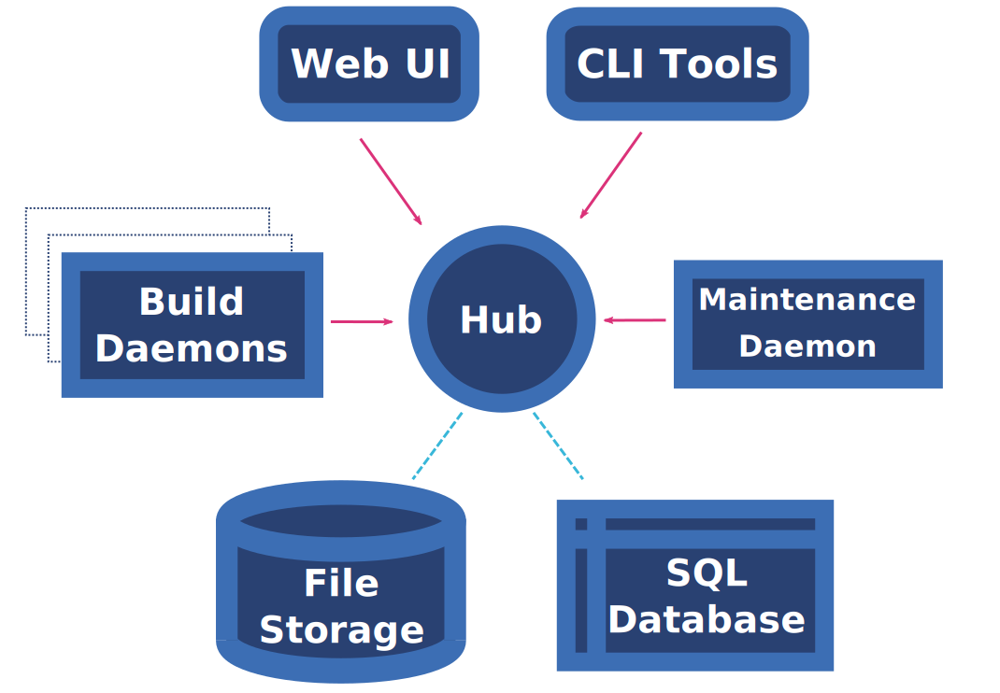

## Установка Koji на виртуальную машину

[источник раз](https://docs.pagure.org/koji/server_howto/) |
[источник два](http://devops-blog.net/koji/koji-rpm-build-system-installation-part-1)

#### Из чего состоит Koji



Во-первых, есть Koji-Hub, который является связующим звеном между всеми остальными элементами. В большинстве случаев, вместо того чтобы работать напрямую друг с другом, они взаимодействуют через koji-hub

Далее, Kojira, сервис, занимающийся созданием и обслуживанием yum/dnf репозиториев

KojiD  (должен быть как минимум один) - это демон, которые делает основную работу (собирает rpm). Его можно выделить в отдельную виртуалку, сервер.  Их может быть много, если планируется работать с большим количеством одновременных сборок. 

Koji-Web - это веб-интерфейс Koji. Полного контроля над процессом с его помощью не получишь, но с ним красивее.

Koji-Client - командный интерфейс Koji. Вот тут у нас полный контроль над всеми возможностями

Все эти части могут работать на физически разных серверах, аутентификация соединения будет происходить либо через Kerberos,  либо через SSL.

Но так как мы учимся, то все это добро поставим на одну слабую виртуалку, потому что можем :)

#### Что потребуется от юзера:

Знания:

- Базовое понимание SSL и аутентификации с помощью сертификатов (неплохо почитать про Kerberos, потому как это второй вариант аутентификации в koji)
- Базовые знания по созданию БД в Postgres и импортирование в нее схемы
- Немного уметь работать с psql
- Чуть знаний Apache
- Базовые навыки работы с dnf/yum/createrepo/mock
- Было бы неплохо владение командной строкой
- Основы по сборке RPM пакетов (иначе зачем вам все это)
- Зачатки умения работы с клиентом koji
- внимательность и стрессоустойчивость

#### Из пакетов понадобятся:

- koji - CLI интерфейс Koji
- koji-hub - связующее звено между всеми элементами Koji
- koji-web - веб-интерфейс Koji
- koji-builder - KojiD, демон сборщик RPM и не только.
- koji-utils - Kojira. Система для работы с репозиториями.
- rpm-build - Для работы с RPM
- httpd - Apache http-сервер
- postgresql-server - Серверная часть СУБД
- mod_ssl - SSL модуль для HTTP сервера Apache
- policycoreutils-python-utils - Требуется для установки необходимых разрешений 

#### Подготовительный этап

1) Ставим RED OS (7.3.1 на момент написания) в варианте минимальный сервер. В принципе можно поставить сервера postgres и apache изначально, но лучше сделать это самим 

2) Для удобства работы настроим вторую сетевую карту на виртуалке и пробросим порты для подключения по SSH (я использую virtualbox, полагаю на других виртуалках схожие возможности имеются)  

 

> **NOTE:**
> 
> Либо можно настроить сетевую карту на виртуалке как bridged adapter, и тогда, если у вас настроен DHCP на роутере, она получит свой IP адрес и можно будет к ней подключаться как к обычному хосту. В итоге это будет сильно удобнее, когда вы дойдете до раздела с веб-интерфейсом.
> 

3) Подключаемся как root (если включили такую возможность. В противном случае как юзер)  

```
ssh -p 3022 root@127.0.0.1
```

4) Делаем снапшот еще пустой системы, дабы, если что-то пойдет сильно не так, можно было быстро откатиться

Все, теперь работаем как белые люди, не нужно настраивать clipboard'ы и т.п.

> **NOTE:**
> 
> Аутентификация в Koji работает либо через Kerberos, либо через SSL. В данном гайде рассматривается SSL

## Создание сертификатов

*С высокой долей вероятности, если Вы раньше не работали с генерацией сертификатов, то после этого гайда Вы будете их ненавидеть*

> **_NOTE:_** 
> 
> *CA это Certificate Authority.*
> 
> Это пара ключ/сертификат используемая для подписи всех прочих запросов сертификации. Когда мы будем конфигурировать разные куски Koji оба сертификата - и клиентский, и серверный будут копией CA сгенерированного здесь. CA сертификат будет размещен в /etc/pki/koji, а сертификаты для остальных компонентов в /etc/pki/koji/certs. 
> index.txt - это база сгенерированных сертификатов. В нем удобно быстро посмотреть когда, кому и что выдали

> **ВАЖНО:**
> 
> Все действия на виртуальной машине выполняются от root'a, если явно не сказано обратное. Например, видим `su kojiadmin`, понимаем, что мы переключаемся на соответствующего пользователя

Для начала, создадим директорию /etc/pki/koji  

```
mkdir -p /etc/pki/koji
```

и поместим туда следующий конфигурационный файл для генерации сертов  

`/etc/pki/koji/ssl.cnf`

```ini
HOME                            = .
RANDFILE                        = .rand

[ca]
default_ca                      = ca_default

[ca_default]
dir                             = .
certs                           = $dir/certs
crl_dir                         = $dir/crl
database                        = $dir/index.txt
new_certs_dir                   = $dir/newcerts
certificate                     = $dir/%s_ca_cert.pem
private_key                     = $dir/private/%s_ca_key.pem
serial                          = $dir/serial
crl                             = $dir/crl.pem
x509_extensions                 = usr_cert
name_opt                        = ca_default
cert_opt                        = ca_default
default_days                    = 3650
default_crl_days                = 30
default_md                      = sha256
preserve                        = no
policy                          = policy_match

[policy_match]
countryName                     = match
stateOrProvinceName             = match
organizationName                = match
organizationalUnitName          = optional
commonName                      = supplied
emailAddress                    = optional

[req]
default_bits                    = 2048
default_keyfile                 = privkey.pem
default_md                      = sha256
distinguished_name              = req_distinguished_name
attributes                      = req_attributes
x509_extensions                 = v3_ca # The extensions to add to the self signed cert
string_mask                     = MASK:0x2002

[req_distinguished_name]
countryName                     = Country Name (2 letter code)
countryName_default             = RU
countryName_min                 = 2
countryName_max                 = 2
stateOrProvinceName             = State or Province Name (full name)
stateOrProvinceName_default     = Vladimir
localityName                    = Locality Name (eg, city)
localityName_default            = Murom
0.organizationName              = Organization Name (eg, company)
0.organizationName_default      = RED-SOFT
organizationalUnitName          = Organizational Unit Name (eg, OS-DEVEL)
commonName                      = insert_hostname
commonName_max                  = 64
emailAddress                    = Email Address
emailAddress_max                = 64

[req_attributes]
challengePassword               = strong and complicated password
challengePassword_min           = 4
challengePassword_max           = 20
unstructuredName                = An optional company name

[usr_cert]
basicConstraints                = CA:FALSE
nsComment                       = "OpenSSL Generated Certificate"
subjectKeyIdentifier            = hash
authorityKeyIdentifier          = keyid,issuer:always

[v3_ca]
subjectKeyIdentifier            = hash
authorityKeyIdentifier          = keyid:always,issuer:always
basicConstraints                = CA:true
```

> **NOTE:** 
> 
> Если бы мы ставили Koji на систему на базе Centos 6,  шифрование было бы:
> 
> ```
> default_md = md5
> ```

Секцию `[req_distinguished_name]` можно отредактировать под свои нужды, дабы потом не приходилось менять дефолтные значения (город например) при каждой генерации сертификата. А их будет много

Поехали дальше

```bash
cd /etc/pki/koji/
mkdir {certs,private,confs}
touch index.txt
echo 01 > serial
openssl genrsa -out private/koji_ca_cert.key 2048
openssl req -config ssl.cnf -new -x509 -days 3650 -key private/koji_ca_cert.key \
-out koji_ca_cert.crt -extensions v3_ca
```

Скорее всего при выполнении последней команды у вас возникнет ошибка следующего характера:

```bash
[root@localhost koji]# openssl req -config ssl.cnf -new -x509 -days 3650 -key private/koji_ca_cert.key \
-out koji_ca_cert.crt -extensions v3_ca
Can't load .rand into RNG
140571765004096:error:2406F079:random number generator:RAND_load_file:Cannot open file:crypto/rand/randfile.c:98:Filename=.rand
```

Это происходит потому, что openssl ожидает увидеть объявленный в ssl.cnf файл .rand в текущей директории. А его там скорее всего нет. Надо это исправлять

```bash
openssl rand -writerand .rand
```

После этого повторяем команду

```bash
openssl req -config ssl.cnf -new -x509 -days 3650 -key private/koji_ca_cert.key \
-out koji_ca_cert.crt -extensions v3_ca
```

На отсутствующий файл ругаться перестанет и мы заполним запрашиваемые значения сертификата, например:

```
You are about to be asked to enter information that will be incorporated
into your certificate request.
What you are about to enter is what is called a Distinguished Name or a DN.
There are quite a few fields but you can leave some blank
For some fields there will be a default value,
If you enter '.', the field will be left blank.

-----

Country Name (2 letter code) [RU]:
State or Province Name (full name) [Vladimir]:
Locality Name (eg, city) [Murom]:
Organization Name (eg, company) [RED-SOFT]:
Organizational Unit Name (eg, OS-DEVEL) []:os-dev
Common Name (your server's hostname) []:stapel667.red-soft.ru
Email Address []:
```

Там, где после двоеточия ничего не поставлено, будут использоваться значения, указанные в квадратных скобках. Именно их мы редактировали в файле ssl.cnf

Результат выполнения команды *tree* (если не поставили - рекомендую, облегчает понимание, что где лежит)

```bash
[root@localhost koji]# tree -a --dirsfirst
.
├── certs
├── confs
├── private
│   └── koji_ca_cert.key
├── index.txt
├── koji_ca_cert.crt
├── .rand
├── serial
└── ssl.cnf
```

#### Еще про сертификаты

У каждого компонента Koji должен быть сертификат, идентифицирующий его. Два из них (для kojihub и koji-web) используются как сертификаты с серверной стороны, для аутентификации сервера-клиенту. Поэтому желательно, чтобы __Common Name__ (он же __CN__) у обоих этих сертификатов был во-первых одинаковым, а во-вторых, чтобы он был FQDN веб-сервера (Fully Qualified Domain Name. В случае этого примера: *stapel667.red-soft.ru*).  
__Organizational Unit Name__ (он же __OU__) можно сделать **kojihub** и **kojiweb**, чтобы их можно было отличить между собой.

Для других сертификатов (kojira, kojid, первичный админский аккаунт, все серты юзеров), используется наоборот, сертификат аутентифицирующий клиента-серверу.  
__Common Name__ для них должен быть логином конкретного компонента. 
Например __CN__ для **kojira** будет, как ни удивительно, **kojira**. Причина для этого в том, что __CN__ сертификата будет использоваться для сравнения с именем пользователя в базе данных **koji**. И если в базе данных не будет имени пользователя совпадающего с конкретным __CN__ - аутентификация не пройдет.

> **NOTE:** 
> 
> Кстати, когда мы создадим сертификат для **kojiweb**, было бы неплохо точно запомнить все данные, которые мы вводили при генерации, так как это потребуется при конфигурировании файла `/etc/koji-hub/hub.conf`, а именно поля ProxyDNs

Для упрощения себе жизни создадим скрипт-генератор сертификатов  
Обзовем его `certgen.sh`

```shell
#!/bin/bash

# if you change your certificate authority name to something else you will
# need to change the caname value to reflect the change.
caname=koji

# user is equal to parameter one or the first argument when you actually
# run the script
user=$1

openssl genrsa -out private/${user}.key 2048

# when you creating an user certificate, it is nice, when script change
# default CN to this username.
# Anyway you have to type it, coz in other case it will be empty string
# insert_hostname keyword (or whatever) should be in your ssl.cnf file
cat ssl.cnf | sed 's/insert_hostname/'${user}'/'> ssl2.cnf

openssl req -config ssl2.cnf -new -nodes -out certs/${user}.csr -key private/${user}.key
openssl ca -config ssl2.cnf -keyfile private/${caname}_ca_cert.key -cert ${caname}_ca_cert.crt \
    -out certs/${user}.crt -outdir certs -infiles certs/${user}.csr
cat certs/${user}.crt private/${user}.key > ${user}.pem
mv ssl2.cnf confs/${user}-ssl.cnf
```

Далее, дадим ему права на запуск

```
chmod +x certgen.sh
```

Кроме того, создадим скрипт поменьше, для генерации сертификата для браузера. Это нам потребуется один раз (если повезет), но лишним не будет.  
Назовем его `webcertgen.sh`. Так же сделаем его запускаемым

```shell
#!/bin/bash
#if you change your certificate authority name to something else you will need to change the caname value to reflect the change.
caname=koji

# user is equal to parameter one or the first argument when you actually run the script

user=$1

openssl pkcs12 -export -inkey private/${user}.key -in certs/${user}.crt \
    -CAfile ${caname}_ca_cert.crt -out certs/${user}_browser_cert.p12
```

```bash
chmod +x webcertgen.sh
```

> **NOTE:** 
> 
> Когда мы сгенерируем сертификат для пользователя, ему потребуются 
> 
> \${user}.pem, \${caname}_ca_cert.crt и \${user}_browser_cert.p12.

Первым делом создадим админа koji и сертификаты для него.
В рамках этого гайда назовем его kojiadmin. Понятное дело, что в реальной системе он может быть назван как угодно

```bash
./certgen.sh kojiadmin
```

Как мы уже обсуждали, **CN** для всего, кроме **koji-hub** и **koji-web,** должен быть равен имени пользователя, иначе аутентификация не пройдет.  
Например:

```bash
Country Name (2 letter code) [RU]:
State or Province Name (full name) [Vladimir]:
Locality Name (eg, city) [Murom]:
Organization Name (eg, company) [RED-SOFT]:
Organizational Unit Name (eg, OS-DEVEL) []:os-dev
kojiadmin []:kojiadmin
Email Address []:
```

Видим, что в нужном месте наш скрипт вежливо подсказал, каким должен быть CN

Пошли дальше. Создадим пользователя в системе и скопируем ему сгенерированные сертификаты в домашнюю папку

```bash
useradd kojiadmin
su kojiadmin
mkdir ~/.koji

# ВАЖНО использовать PEM а не CRT
cp /etc/pki/koji/kojiadmin.pem ~/.koji/client.crt

cp /etc/pki/koji/koji_ca_cert.crt ~/.koji/clientca.crt
cp /etc/pki/koji/koji_ca_cert.crt ~/.koji/serverca.crt
exit
```

> **NOTE:**
> 
> Настройки koji хранятся в файле `/etc/koji.conf`. Если требуется настройка в зависимости от пользователя, то можно разместить файл koji.conf в ~/.koji каждого конкретного юзера

### База данных

Мы будем использовать postgres, в теории можно любую.

Установим сервер БД и CLI koji

```bash
dnf install -y postgresql-server koji
```

Инициализируем БД и запускаем сервис

```bash
postgresql-setup --initdb --unit postgresql
systemctl enable postgresql --now
```

Создаем пользователя koji. Для удобства сделаем без пароля.

```bash
useradd koji
passwd -d koji
```

Теперь настроим postgres и создадим схему

```bash
su postgres
createuser --no-superuser --no-createrole --no-createdb koji
createdb -O koji koji
su koji
psql koji koji < /usr/share/doc/koji*/docs/schema.sql
\q
exit
```

> **NOTE:**
> 
> __Важно__: Когда импортируем схему в чистую БД,  необходимо, чтобы это осуществлялось от лица koji юзера. Иначе будут проблемы

Отредактируем `/var/lib/pgsql/data/pg_hba.conf` 
Так как мы все делаем на одной машине: 

```ini
#TYPE   DATABASE    USER    CIDR-ADDRESS      METHOD
local   koji        koji                       trust
local   all         postgres                   peer
```

> **NOTE:**
> 
> - Тип соединения __local__  означает, что postgres использует локальный Unix сокет, поэтому PostgreSQL не открывается по TCP/IP.
> 
> - Локальный юзер __koji__ должен иметь доступ только к базе данных __koji__. Локальный пользователь __postgres__ будет иметь доступ ко всему (это нужно для создания юзеров и таблиц)
> 
> - CIDR-ADDRESS пустой, потому что в нашем случае мы используем локальные Unix сокеты.
> 
> - Метод __trust__ значит, что PosgreSQL разрешит любое соединение от любого локального юзера с таким именем. Мы установили это для юзера __koji__, потому что Apache httpd запускается как  пользователь __apache__ вместо пользователя __koji__ когда подсоединяется к сокету Unix. 
>   
>   __trust__ не особо секьюрно в системах с множеством пользователей , но в нашей однозадачной системе это нормально.
> 
> - Метод __peer__ означает, что PostgreSQL получит юзернейм пользователя и будет выполнять то, что этому пользователю позволено. Это безопаснее, потому как только локальные юзеры postgres смогут подключиться к PostgreSQL с этим уровнем доступа.

В файле `/var/lib/pgsql/data/postgresql.conf` блокируем доступ по TCP/IP (мы ж на одной машине все делаем)

```ini
listen_addresses = ''
```

Перезапускаем postgres

```bash
systemctl reload postgresql
```

Создадим нашего __kojiadmin__'a в БД

```bash
su koji
psql
insert into users (name, status, usertype) values ('kojiadmin', 0, 0);
insert into user_perms (user_id, perm_id, creator_id) values (1, 1, 1);
\q
exit
```

С базой данный все.
Теперь опять к сертификатам

### Koji-hub

Установим **apache**, **koji-hub** и ssl-модуль для апача

```bash
dnf install -y httpd koji-hub mod_ssl
```

Сгенерируем сертификаты для kojihub и kojiweb. Как мы помним, **CN** в этом случае равен FQDN (в моем случае, *stapel667.red-soft.ru*), а **OU** - **kojihub** или **kojiweb** соответственно. Тут наша подсказка, которая заменяет **CN**, будет немного мешать, поэтому будьте внимательны и осторожны

```bash
cd /etc/pki/koji
./certgen.sh kojiweb
./certgen.sh kojihub
```

Что в нашей любимой папке:

```bash
[root@localhost koji]# tree -a --dirsfirst
.
├── certs
│   ├── 01.pem
│   ├── 02.pem
│   ├── 03.pem
│   ├── 04.pem
│   ├── kojiadmin.crt
│   ├── kojiadmin.csr
│   ├── kojihub.crt
│   ├── kojihub.csr
│   ├── kojiweb.crt
│   └── kojiweb.csr
├── confs
│   ├── kojiadmin-ssl.cnf
│   ├── kojihub-ssl.cnf
│   └── kojiweb-ssl.cnf
├── private
│   ├── kojiadmin.key
│   ├── koji_ca_cert.key
│   ├── kojihub.key
│   └── kojiweb.key
├── certgen.sh
├── index.txt
├── index.txt.attr
├── index.txt.attr.old
├── index.txt.old
├── kojiadmin.pem
├── koji_ca_cert.crt
├── kojihub.pem
├── kojiweb.pem
├── .rand
├── serial
├── serial.old
├── ssl.cnf
└── webcertgen.sh
```

Можем посмотреть, какие сертификаты мы на текущий момент создали в `index.txt`

```ini
[root@localhost koji]# cat index.txt
V    320805071659Z        01    unknown    /C=RU/ST=Vladimir/O=RED-SOFT/OU=os-dev/CN=kojiadmin
V    320805075641Z        02    unknown    /C=RU/ST=Vladimir/O=RED-SOFT/OU=kojiweb/CN=stapel667.red-soft.ru
V    320805075713Z        03    unknown    /C=RU/ST=Vladimir/O=RED-SOFT/OU=kojihub/CN=stapel667.red-soft.ru
```

В ```/etc/httpd/conf.d/kojihub.conf``` раскомментируем первый блок и слегка правим второй (иначе koji может не найти уже собранные пакеты для сборки новых):

```ini
# uncomment this to enable authentication via SSL client certificates

<Location /kojihub/ssllogin>
  SSLVerifyClient require
  SSLVerifyDepth  10
  SSLOptions +StdEnvVars
</Location>

<Directory "/mnt/ssd/koji">
    #Options Indexes SymLinksIfOwnerMatch
    #If your top /mnt/ssd/koji directory is not owned by the httpd user, then
    #you will need to follow all symlinks instead, e.g.
    Options Indexes FollowSymLinks
    Options -SymLinksIfOwnerMatch +FollowSymLinks
    AllowOverride None
    Require all granted
    #If you have httpd <= 2.2, you'll want the following two lines instead
    #of the one above:
    #Order allow,deny
    #Allow from all
    IndexOptions NameWidth=*
</Directory>
```

В `/etc/httpd/conf.d/ssl.conf` укажем требуемые пути до ключей и сертификатов

```apacheconf
ServerName stapel667.red-soft.ru:443

SSLCertificateFile /etc/pki/koji/certs/kojihub.crt
SSLCertificateKeyFile /etc/pki/koji/private/kojihub.key
SSLCertificateChainFile /etc/pki/koji/koji_ca_cert.crt
SSLCACertificateFile /etc/pki/koji/koji_ca_cert.crt

SSLVerifyClient require
SSLVerifyDepth 10
```

В `/etc/koji-hub/hub.conf`

```ini
DBName = koji
DBUser = koji

KojiDir = /mnt/koji
LoginCreatesUser = On
KojiWebURL = http://stapel667.red-soft.ru/koji

# Отключим рассылку сообщений о выполнении сборки
NotifyOnSuccess = False
DisableNotifications = True

DNUsernameComponent = CN
ProxyDNs = CN=stapel667.red-soft.ru,OU=kojiweb,O=RED-SOFT,ST=Vladimir,C=RU
```

Чтобы позволить апачу подсоединиться к БД

```bash
setsebool -P httpd_can_network_connect_db=1
```

#### Подготовка файловой системы

```bash
cd /mnt
mkdir koji
cd koji
mkdir {packages,repos,work,scratch,repos-dist}
chown apache.apache *
```

Нужно поставить нехватающую либу (semanage)

```bash
dnf install -y policycoreutils-python-utils
```

Разрешим апачу писать в созданную файловую систему

```bash
setsebool -P allow_httpd_anon_write=1
semanage fcontext -a -t public_content_rw_t "/mnt/koji(/.*)?"
restorecon -r -v /mnt/koji
```

Запустим Apache

```bash
systemctl enable httpd.service --now
```

### Koji CLI

Зайдем в ```/etc/koji.conf```

```ini
[koji]

;url of XMLRPC server
server = http://stapel667.red-soft.ru/kojihub

;url of web interface
weburl = http://stapel667.red-soft.ru/koji

;url of package download site
topurl = http://stapel667.red-soft.ru/kojifiles

;path to the koji top directory
topdir = /mnt/koji

; configuration for SSL athentication

;client certificate
cert = ~/.koji/client.crt

;certificate of the CA that issued the HTTP server certificate
serverca = ~/.koji/serverca.crt
```

Проверим

```bash
su kojiadmin
koji moshimoshi
```

Может возникнуть следующая проблема:

```bash
[kojiadmin@localhost koji]$ koji moshimoshi
2022-08-08 11:34:11,550 [ERROR] koji: ConnectionError: HTTPSConnectionPool(host='stapel667.red-soft.ru', port=443): Max retries exceeded with url: /kojihub/ssllogin (Caused by NewConnectionError('<urllib3.connection.HTTPSConnection object at 0x7f7eb4dfc070>: Failed to establish a new connection: [Errno -2] Name or service not known'))
```

Это происходит потому, что koji понятия не имеет, куда идти по адресу __CN__

Решается она просто, идем в файл `/etc/hosts`

```ini
127.0.0.1 stapel667.red-soft.ru
```

В результате, должно получиться следующее:

```bash
[kojiadmin@localhost koji]$ koji moshimoshi
olá, kojiadmin!

You are using the hub at https://stapel667.red-soft.ru/kojihub
Authenticated via client certificate /home/kojiadmin/.koji/client.crt
```

Можно проверить и так:

```bash
koji call getLoggedInUser
exit
```

```bash
[kojiadmin@localhost koji]$ koji call getLoggedInUser
{'authtype': 2,
 'id': 1,
 'krb_principal': None,
 'krb_principals': [],
 'name': 'kojiadmin',
 'status': 0,
 'usertype': 0}
```

> **NOTE:**
> 
> На самом деле это только один из вариантов проблем. Остальные 150 штук в основном возникают из-за косяков с сертификатами и путей к ним в конфигах.

#### Koji-Web

Установим **koji-web**. **mod_ssl** мы уже ставили ранее

```bash
dnf install -y koji-web
```

Идем в `/etc/httpd/conf.d/kojiweb.conf` и раскомментируем

```apacheconf
# uncomment this to enable authentication via SSL client certificates

<Location /koji/login>
    SSLVerifyClient require
    SSLVerifyDepth  10
    SSLOptions +StdEnvVars
</Location>
```

Файл `/etc/httpd/conf.d/ssl.conf` мы уже откорректировали ранее

Пошли в `/etc/kojiweb/web.conf`

```ini
[web]
SiteName = koji
# KojiTheme =

# Necessary urls
KojiHubURL = https://stapel667.red-soft.ru/kojihub
KojiFilesURL = http://stapel667.red-soft.ru/kojifiles

## SSL authentication options
WebCert = /etc/pki/koji/kojiweb.pem
ClientCA = /etc/pki/koji/koji_ca_cert.crt
KojiHubCA = /etc/pki/koji/koji_ca_cert.crt

LoginTimeout = 72

# This must be set before deployment
Secret = CHANGE_ME

LibPath = /usr/share/koji-web/lib
```

Для того, чтобы при заходе на наше доменное имя (в данном случае *stapel667.red-soft.ru*) нас перебрасывало на интересующую нас страницу, а именно /koji, настроим редирект в файле `/etc/httpd/conf/httpd.conf`

```apacheconf
RedirectMatch ^/$ /koji/
```

Перезапустим Apache

```bash
systemctl restart httpd.service
```

В принципе, веб-интерфейс уже должен работать. Но залогиниться не получится, так как мы не сгенерировали сертификат для браузера

Идем в `/etc/pki/koji` и запускаем `webcertgen.ch` для __kojiadmin__

```bash
cd /etc/pki/koji
./webcertgen.sh kojiadmin
```

Попробуем зайти на веб-интерфейс.

Можем получить следующее сообщение

```bash
An error has occurred while processing your request.
ConnectionError: HTTPConnectionPool(host='stapel667.red-soft.ru', port=80): Max retries exceeded with url: /kojihub (Caused by NewConnectionError('<urllib3.connection.HTTPConnection object at 0x7fa47ff8b4d0>: Failed to establish a new connection: [Errno 13] Permission denied',))
```

Решается она несложно

```bash
setsebool -P httpd_can_network_connect on
```

После этого все должно быть в порядке.

Для того, чтобы залогиниться, нам потребуется импортировать `kojiadmin_browser_cert.p12` в браузер. Если все пройдет удачно, то мы сможем зайти под kojiadmin


#### KojiD - builder

Этот демон ответственный за сборку пакетов, кроме того, он умеет создавать LiveCD и прочие образы. Но нам это пока без надобности. Под капотом он использует mock для создания чистых окружений для каждого билда и chroot'a в них

Установка

```bash
dnf install -y koji-builder
```

Сгенерируем сертификат для него. Как помним, **CN** должен быть именем юзера, в нашем случае пусть будет __kojibuilder1.red-soft.ru__. Результирующее название файла сертификата значения не имеет, поэтому будет kojid

```bash
cd /etc/pki/koji
./certgen.sh kojid
```

Желательно, чтобы сертификаты для каждого билдера лежали в его конфигурационной директории

```bash
cp /etc/pki/koji/{koji_ca_cert.crt,kojid.pem} /etc/kojid/
```

Добавим нового пользователя в базу

```bash
su kojiadmin
koji add-host kojibuilder1.red-soft.ru i386 x86_64
exit
```

Определили имя хоста kojibuilder'a и архитектуры, которые он использует

> **NOTE:**
> 
> Важно, чтобы мы добавили kojibuilder в базу до старта демона, иначе придется вычищать записи из базы, прежде чем оно сможет запуститься

Идем в `/etc/kojid/kojid.conf`

```ini
[kojid]
topdir=/mnt/koji
workdir=/tmp/koji
user=kojibuilder1.red-soft.ru
server=http://stapel667.red-soft.ru/kojihub
topurl=http://stapel667.red-soft.ru/kojifiles

cert = /etc/kojid/kojid.pem
serverca = /etc/kojid/koji_ca_cert.crt
```

Добавим нашего билдера на канал. Каналы - это способ контролировать, какой билдер чем занят. Если создавать без аргумента, то хост попадет в default канал. Но хотя бы какой-то из билдеров должен быть добавлен в канал createrepo, иначе некому будет выполнять запросы **kojira** (об этом чуть позже)

```bash
su kojiadmin
koji add-host-to-channel kojibuilder1.red-soft.ru createrepo
exit
```

Запускаем демона

```bash
systemctl enable kojid.service --now
```

Теперь, если мы нигде не ошиблись, в разделе hosts должен появиться наш билдер


#### Kojira - Работа с Dnf|Yum репозиториями

Установка

```bash
dnf install -y koji-utils
```

Сгенерируем очередной сертификат. Здесь **CN** можно использовать просто **kojira**.

```bash
cd /etc/pki/koji
./certgen.sh kojira
```

Создадим пользователя. Кроме того этот пользователь требует разрешение на работу с репозиториями

```bash
su kojiadmin
koji add-user kojira
koji grant-permission repo kojira
exit
```

В файле `/etc/kojira/kojira.conf`

```ini
[kojira]
server=http://stapel667.red-soft.ru/kojihub

topdir=/mnt/koji

cert = /etc/pki/koji/kojira.pem
serverca = /etc/pki/koji/koji_ca_cert.crt
```

Запускаем **kojira**

```bash
systemctl enable kojira.service --now
```

> В некоторых версиях koji есть баг, вызывающий ошибку ```multiple rows returned for a single row query``` при попытке посмотреть юзеров на веб-интерфейсе. 
> 
> Лечится следующим патчем
> 
> ```diff
> > --- kojihub.py  2022-08-08 17:36:34.414862236 +0300
> +++ kojihub.py.mod      2022-08-08 17:36:22.059884272 +0300
> @@ -8653,7 +8653,7 @@
>     def execute(self):
>         query = str(self)
>         if self.opts.get('countOnly'):
> -            return _singleValue(query, self.values, strict=True)
> +            return _singleValue(query, self.values, strict=False)
>         elif self.opts.get('asList'):
>             if self.transform is None:
>                 return _fetchMulti(query, self.values)
> ```
> 
> Применяем его к файлу `/usr/share/koji-hub/kojihub.py`
> Технически мы просто поменяли проверку возвращаемого значения по запросу из базы со `strict=True` на `strict=False`
> 
> После этого перезапускаем httpd.service
> 
> ```bash
> systemctl restart httpd.service
> ```

На этом с установкой и настройкой Koji все. Далее будем подключать репозитории и пытаться использовать то, что мы создали.

### Подготавливаем Koji к работе с помощью внешних репозиториев

Итак, мы все настроили и запустили, веб-интерфейс функционирует, командная строка тоже, нужные юзеры имеются, билдер готов к работе. Только что со всем этим добром делать - пока не понятно.

Koji использует теги (**tag**) для идентификации и маркировки различных этапов процесса сборки RPM. Некоторые теги логически связаны друг с другом одной и той же идеей, например, сборкой для определенного дистрибутива. Мы назовем этот целевой тег **dist-redos73**. 

Нам также нужен тег, который используется для сборки и наследует ту же цель. Мы назовём этот тег **dist-redos73-build**

Для сборки RPM Koji использует инструмент под названием mock. Mock создает чистое сборочное окружение в chroot'e. В эти chroot'ы он устанавливает базовый набор пакетов из виртуальных групп yum/dnf под названием **build** и **srpm-build**. Соответственно, мы должны указать Koji, какие пакеты будут входить в эти группы. В принципе, мы можем туда записать хоть весь наш репозиторий, но есть нюанс - эти пакеты будут устанавливаться в КАЖДОЕ сборочное окружение для каждого собираемого RPM. Соответственно, лучше выбирать поменьше и то, что действительно нужно.
Кроме того, Koji должен знать, откуда брать пакеты, поэтому мы добавим внешние репозитории.

Обычно теги называют следующим образом `dist-SOME_NAME,  dist-SOME_NAME-build`

```bash
su kojiadmin
koji add-tag dist-redos73
koji add-tag --parent dist-redos73 --arches "x86_64" dist-redos73-build
```

То есть, создаем тег, затем создаем дочерний тег (в родители прописываем предыдущий), указываем, какая архитектура будет использоваться при сборке, и даем ему имя

Добавим внешние репозитории

```bash
koji add-external-repo -t dist-redos73-build os73-base-repo https://repo1.red-soft.ru/redos/7.3/\$arch/os
koji add-external-repo -t dist-redos73-build os73-kernel-repo https://repo1.red-soft.ru/redos/7.3/\$arch/kernels
koji add-external-repo -t dist-redos73-build os73-updates-repo https://repo1.red-soft.ru/redos/7.3/\$arch/updates
```

Создадим цель (target)

```bash
koji add-target dist-redos73 dist-redos73-build
```

Можем посмотреть информацию по созданному тегу

```bash
[kojiadmin@localhost ~]$ koji taginfo dist-redos73-build
Tag: dist-redos73-build [2]
Arches: x86_64
Groups:
Tag options:
This tag is a buildroot for one or more targets
Current repo: no active repo
Targets that build from this tag:
  dist-redos73
External repos:
    5 os73-base-repo (https://repo1.red-soft.ru/redos/7.3/$arch/os/)
   10 os73-kernel-repo (https://repo1.red-soft.ru/redos/7.3/$arch/kernels/)
   15 os73-updates-repo (https://repo1.red-soft.ru/redos/7.3/$arch/updates/)
Inheritance:
  0    .... dist-redos73 [1]
```

Создадим билд группу, то есть базовый набор устанавливаемых в окружение пакетов

```bash
koji add-group dist-redos73-build build
koji add-group-pkg dist-redos73-build build bash bzip2 coreutils cpio diffutils findutils gawk gcc gcc-c++ grep gzip info make patch perl-Getopt-Long perl-Pod-Usage perl-Storable python-rpm-macros python-srpm-mac python-srpm-macros python2-rpm-macros python3-rpm-macros rdo-rpm-macros redhat-rpm-config redos-release rpm-build sed shadow-utils tar unzip util-linux util-linux-ng which

koji regen-repo dist-redos73-build
```

Поставим `systemd-container` (он же `systemd-nspawn`), который mock использует для контейнеризации, вместо обычного chroot'a. Иначе получим ошибку на сборке пакета вида

```bash
No such file or directory: '/usr/bin/systemd-nspawn'
No such file or directory: '/bin/machinectl'
```

```bash
dnf install -y systemd-container
```

Кроме того, скажем mock'у использовать dnf по умолчанию. Плюс, отключим Koji функцию ребилда srpm (она используется для проверки **N**ame**V**ersion**R**elease) в результирующем билде

```bash
koji edit-tag dist-redos73-build -x mock.package_manager=dnf
koji edit-tag dist-redos73-build -x rebuild_srpm=False
```

Проверим в работе, то что мы создали

Сначала установим `rpm-build`. Он потребуется для переупаковки под требуемый билд 

```bash
dnf install -y rpm-build
```

Скачаем для примера srpm простого эмулятора терминала ST

```bash
su kojiadmin
cd ~
wget https://kojipkgs.fedoraproject.org//packages/st/0.8.4/6.fc37/src/st-0.8.4-6.fc37.src.rpm
```

Теперь распакуем его в rpm build-tree

```bash
rpmbuild -rp st-0.8.4-6.fc37.src.rpm
```

Перепакуем под наш билд

```bash
rpmbuild -bs rpmbuild/SPEC/st.spec
```

И, наконец-то, запустим пакет на сборку

```bash
koji build dist-redos73 rpmbuild/SRPMS/st-0.8.4-6.el7.src.rpm
```

На веб-интерфейсе можем наблюдать процесс сборки нашего пакета


И если все удачно, то в результате получим собранный пакет и добавим его в наш репозиторий


